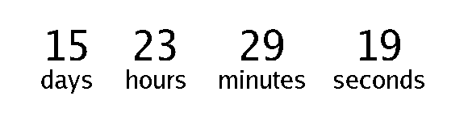

# countdown-gen

My take on a gif countdown generator using golang



## Usage

Dev:

```shell
go run app.go YYYY-MM-DD HH:MM:SS
```

Build:

```shell
go build app.go
```

Prod:

```shell
./app YYYY-MM-DD HH:MM:SS
```
